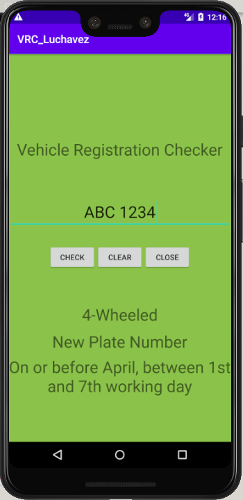
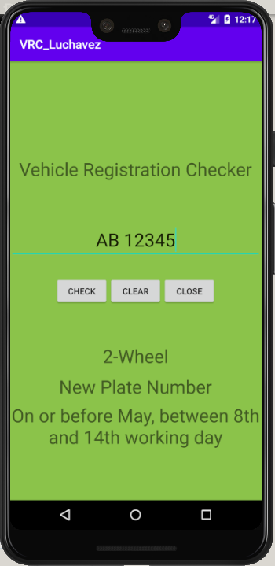
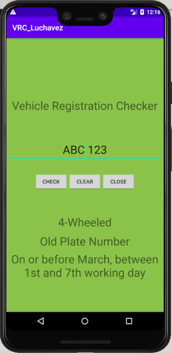
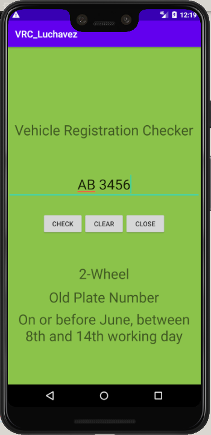
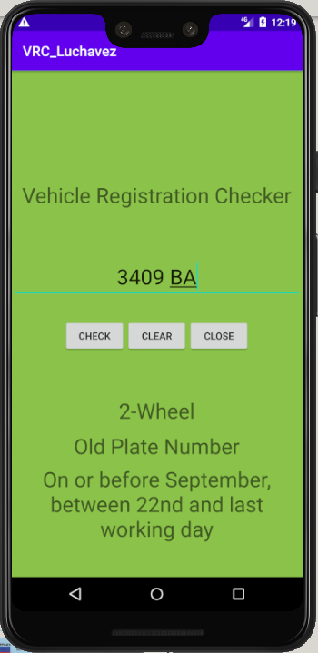
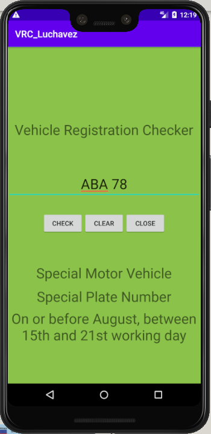

# Vehicle Registration Checker

### For New License Plate
* Four-wheeled vehicles

  

* Two-wheeled vehicles

  

### For Old License Plate
* Four-wheeled vehicles

  

* Two-wheeled vehicles

  

  

### Optional Motor Vehicle Special Plate

  

